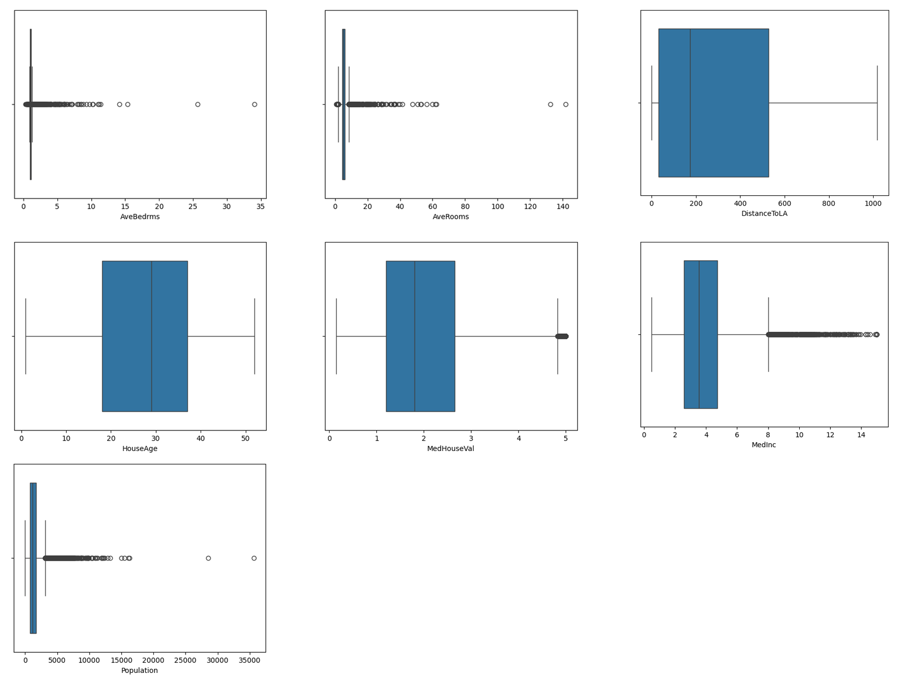

# Laporan Proyek Machine Learning - Al Jauzi Abdurrohman

## Domain Proyek

Permasalahan dalam sektor properti, khususnya perumahan, merupakan topik penting baik bagi individu maupun instansi. Di negara bagian California, harga rumah mengalami fluktuasi yang dipengaruhi oleh berbagai faktor seperti jumlah penduduk, tingkat pendapatan, dan lokasi geografis. Oleh karena itu, penting untuk memahami faktor-faktor apa saja yang dapat memengaruhi harga rumah agar dapat membantu calon pembeli, pengembang properti, hingga investor dalam membuat keputusan yang lebih tepat.

Dalam proyek ini, akan dilakukan analisis dan pembuatan model prediksi harga rumah berdasarkan data demografis dan geografis dari California Housing Dataset. Dataset ini merepresentasikan kondisi blok-blok sensus pada tahun 1990 di California dan sering digunakan untuk kasus regresi di bidang data science dan real estate.

## Business Understanding

### Problem Statements
1. Bagaimana hubungan antara faktor demografis (seperti kepadatan penduduk dan tingkat pendidikan) dengan harga rumah?
2. Dapatkah kita memprediksi harga median rumah di suatu daerah menggunakan data demografis dan geografis?
3. Fitur apa yang paling berpengaruh terhadap harga rumah di California?

### Goals
1. Mengetahui fitur-fitur yang secara signifikan berkorelasi dengan harga rumah.
2. Membangun model prediksi harga rumah berdasarkan fitur yang tersedia.
3. Menganalisis pentingnya masing-masing fitur untuk memahami kontribusinya terhadap nilai harga rumah.

## Data Understanding
Dataset yang digunakan adalah California Housing Dataset dari sklearn.datasets, yang juga tersedia di Kaggle California Housing Dataset dan berasal dari California Census tahun 1990 (URL: https://scikit-learn.org/stable/modules/generated/sklearn.datasets.fetch_california_housing.html). Pada sel kode notebook, dataset ini dapat diunduh menggunakan kode berikut:
```sh
from sklearn.datasets import fetch_california_housing
data = fetch_california_housing(as_frame=True)
df = data.frame
```
Dataset ini berisi 20.640 baris data dan 9 kolom (8 fitur dan 1 target).

### Variabel-variabel pada California Housing Dataset adalah sebagai berikut:

| Kolom | Tipe Data | Deskripsi |
| ------ | ------ | ------ |
| MedInc | float64 | Median pendapatan dalam blok (dalam puluhan ribu dolar AS). |
| HouseAge | float64 | Umur median rumah di blok. |
| AveRooms | float64 | Rata-rata jumlah kamar per rumah. |
| AveBedrms | float64 | Rata-rata jumlah kamar tidur per rumah. |
| Population | float64 | Jumlah penduduk dalam blok. |
| AveOccup | float64 | Rata-rata jumlah penghuni per rumah. |
| Latitude | float64 | Koordinat geografis lintang. |
| Longitude | float64 | Koordinat geografis bujur. |
| MedHouseVal | float64 | Median nilai rumah dalam satu blok (dalam ratusan ribu dolar AS). |

Variabel Latitude dan Longitude merupakan variabel kesatuan, agar model ML yang digunakan dapat menginterpretasikan variabel ini lebih mudah, maka pada tahap Data Preparation kita akan mengubah kedua variabel tersebut menjadi satu variabel: DistanceToLA, yaitu jarak ke pusat kota (Los Angeles).

## Data Preparation
Pada tahap ini akan dilakukan proses Exploratory Data Analysis yang mencakup pemeriksaan missing value, nilai outlier, univariate analysis, dan multivariate analysis.

Namun, sebelum masuk ke tahap EDA, kita akan mengubah variabel Latitude dan Longitude menjadi satu variabel DistanceToLA yang merepresentasikan jarak ke pusat kota (Los Angeles) menggunakan formula haversine dengan kode berikut:
```sh
df['DistanceToLA'] = haversine(df['Latitude'], df['Longitude'], 34.05, -118.25)
```
Formula Haversine adalah rumus matematika yang digunakan untuk menghitung jarak terpendek (great-circle distance) antara dua titik di permukaan bumi berdasarkan lintang (latitude) dan bujur (longitude), dengan asumsi bahwa bumi berbentuk bulat sempurna. Parameter `34.05` dan `118.25` adalah latitude dan longitude untuk kota Los Angeles secara berurutan.
### EDA - Missing Value
Untuk memeriksa apakah terdapat missing value, jalankan kode berikut:
```sh
df.describe()
```
Output yang tampil seperti ini:
| | Medinc | HouseAge | AveRooms | AveBedrms | Population | AveOccup | MedHouseVal | DistanceToLA
| ------ | ------ | ------ | ------ | ------ | ------ | ------ | ------ | ------ |
| **count** | 20640.000000 | 20640.000000 | 20640.000000 | 20640.000000 | 20640.000000 | 20640.000000 | 20640.000000 | 20640.000000 |
| **min** | 3.870671 | 28.639486 | 5.429000 | 1.096675 | 1425.476744 | 3.070655	| 2.068558 | 269.411741 |
| **std** | 1.899822 | 12.585558 | 2.474173	| 0.473911 | 1132.462122 | 10.386050 | 1.153956 | 247.652206 | 
| **min** | 0.499900 | 1.000000 | 0.846154 | 0.333333 | 3.000000 | 0.692308	| 0.149990 | 0.000000 |
| **25%** | 2.563400 | 18.000000 | 4.440716 | 1.006079 | 787.000000 | 2.429741 | 1.196000 | 32.223307|
| **50%** | 3.534800 | 29.000000 | 5.229129 | 1.048780 | 1166.000000 | 2.818116 | 1.797000 | 173.825911 |
| **75%** | 4.743250 | 37.000000 | 6.052381 | 1.099526 | 1725.000000 | 3.282261 | 2.647250 | 526.985985 |
| **max** | 15.000100 | 52.000000 | 141.909091 | 34.066667 | 35682.000000 | 1243.333333 | 5.000010 | 1018.198911 |

Terdapat missing value (bernilai 0) pada kolom DistanceToLA dan setelah dilakukan pemeriksaan, baris dengan missing value tersebut hanya ada dua. Jumlah ini tergolong kecil dibandingkan jumlah keseluruhan baris, maka dari itu baris tersebut akan dihapus.

### EDA - Outlier
Untuk memeriksa nilai outlier, kita perlu memvisualisasikan persebaran data setiap kolom menggunakan boxplot dengan kode berikut:
```sh
sns.boxplot(x=df['{namaKolom}'])
```
Hasil untuk seluruh kolom ditampilkan pada gambar berikut:

Berdasarkan gambar tersebut dapat diketahui bahwa terdapat outlier pada variabel MedInc, AveRooms, AveBedrms, Population, AveOccup, dan MedHouseVal. Maka dari itu, kita akan melakukan teknik winsorizing, yaitu mengubah nilai outlier menjadi nilai ambang atas atau ambang bawah, sehingga tidak mengurangi data yang sudah ada.
Teknik winsorizing dapat dilakukan dengan menerapkan kode berikut:
```sh
df[numeric_cols] = df[numeric_cols].clip(lower=lower_bound, upper=upper_bound, axis=1)
```
Di mana `numeric_cols` adalah variabel yang bertipe data angka, `lower_bound` adalah batas bawah, dan `upper_bound` adalah batas atas. Jika ada nilai yang melewati batas bawah, maka nilai tersebut akan dijadikan nilai batas bawah, begitu juga dengan kasus outlier yang melewati batas atas.

### EDA - Univariate Analysis
Untuk melihat visualisasi univariate analysis, kita dapat melakukannya dengan menerapkan visualisasi histogram dengan kode berikut:
```sh
df.hist(bins=50, figsize=(20,15))
plt.show()
```
Sehingga menghasilkan gambar berikut:

Pada variabel target, yaitu variabel MedHouseVal, dapat dilihat bahwa:
- Peningkatan harga rumah sebanding dengan penurunan jumlah sampel. Hal ini dapat kita lihat jelas dari histogram "MedHouseVal" yang grafiknya mengalami penurunan seiring dengan semakin banyaknya jumlah sampel (sumbu y). Namun terdapat suatu harga di antara 4-5 (ratus ribu dolar AS) yang memiliki sampel yang tinggi.
- Rentang harga rumah cukup beragam yaitu dari skala puluhan ribu dolar hingga >$500.000 Amerika Serikat.
- Distribusi harga miring ke kanan (right-skewed). Hal ini akan berimplikasi pada model.
### EDA - Multivariate Analysis
Untuk mengamati hubungan antara fitur numerik, kita akan menggunakan fungsi pairplot() dengan kode berikut:
```sh
sns.pairplot(df, diag_kind = 'kde')
```
Sehingga menghasilkan gambar berikut:

Variabel MedHouseVal yang menjadi variabel target berada di baris ke-7. Sebaran data yang terlihat pada plot masih acak, kecuali pada variabel MedInc dan DistanceToLA. Variabel MedInc berbanding lurus dengan variabel target, sedangkan variabel DistanceToLA berbanding terbalik dengan variabel target. Artinya, semakin tinggi median pendapatan maka semakin tinggi juga harga perumahan, dan semakin jauh perumahan tersebut dari pusat kota, maka harga perumahan semakin rendah.

Untuk memperjelas nilai korelasi seluruh variabel numerik dengan variabel target, kita akan menggunakan visualisasi correlation matrix dengan kode berikut:
```sh
plt.figure(figsize=(10, 8))
correlation_matrix = df[numerical_features].corr().round(2)
sns.heatmap(data=correlation_matrix, annot=True, cmap='coolwarm', linewidths=0.5, )
plt.title("Correlation Matrix untuk Fitur Numerik ", size=20)
```
Sehingga menghasilkan gambar berikut:

Setelah diamati, variabel yang memiliki nilai korelasi tertinggi adalah variabel MedInc (korelasi positif), AveRooms (korelasi positif), AveOccup (korelasi negatif), DistanceToLA (korelasi negatif), HouseAge (korelasi positif), dan AveBedrms (korelasi negatif). Variabel Population memiliki nilai korelasi yang rendah, yaitu -0,03 (kurang dari ±0.1), sehingga variabel ini akan dihapus dan tidak diikutsertakan dalam perhitungan dengan kode berikut:
```sh
df.drop(['Population'], inplace=True, axis=1)
```
## Modeling
Tahapan ini membahas mengenai model machine learning yang digunakan untuk menyelesaikan permasalahan. Anda perlu menjelaskan tahapan dan parameter yang digunakan pada proses pemodelan.

**Rubrik/Kriteria Tambahan (Opsional)**: 
- Menjelaskan kelebihan dan kekurangan dari setiap algoritma yang digunakan.
- Jika menggunakan satu algoritma pada solution statement, lakukan proses improvement terhadap model dengan hyperparameter tuning. **Jelaskan proses improvement yang dilakukan**.
- Jika menggunakan dua atau lebih algoritma pada solution statement, maka pilih model terbaik sebagai solusi. **Jelaskan mengapa memilih model tersebut sebagai model terbaik**.

## Evaluation
Pada bagian ini anda perlu menyebutkan metrik evaluasi yang digunakan. Lalu anda perlu menjelaskan hasil proyek berdasarkan metrik evaluasi yang digunakan.

Sebagai contoh, Anda memiih kasus klasifikasi dan menggunakan metrik **akurasi, precision, recall, dan F1 score**. Jelaskan mengenai beberapa hal berikut:
- Penjelasan mengenai metrik yang digunakan
- Menjelaskan hasil proyek berdasarkan metrik evaluasi

Ingatlah, metrik evaluasi yang digunakan harus sesuai dengan konteks data, problem statement, dan solusi yang diinginkan.

**Rubrik/Kriteria Tambahan (Opsional)**: 
- Menjelaskan formula metrik dan bagaimana metrik tersebut bekerja.

**---Ini adalah bagian akhir laporan---**

_Catatan:_
- _Anda dapat menambahkan gambar, kode, atau tabel ke dalam laporan jika diperlukan. Temukan caranya pada contoh dokumen markdown di situs editor [Dillinger](https://dillinger.io/), [Github Guides: Mastering markdown](https://guides.github.com/features/mastering-markdown/), atau sumber lain di internet. Semangat!_
- Jika terdapat penjelasan yang harus menyertakan code snippet, tuliskan dengan sewajarnya. Tidak perlu menuliskan keseluruhan kode project, cukup bagian yang ingin dijelaskan saja.